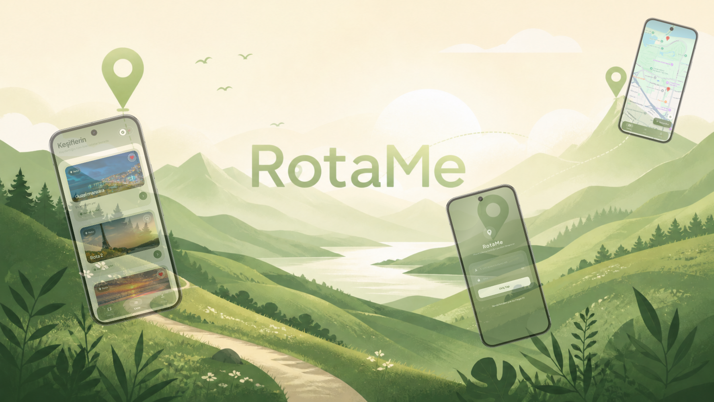
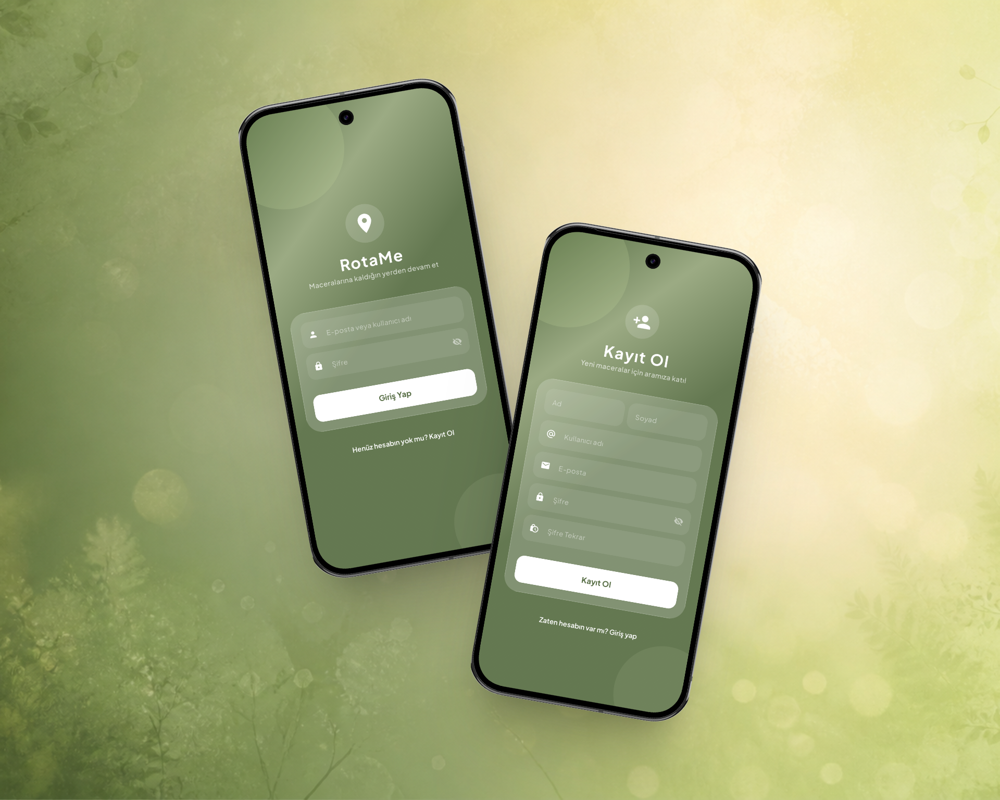
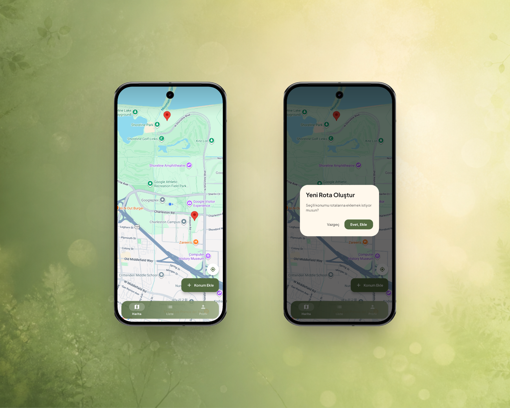
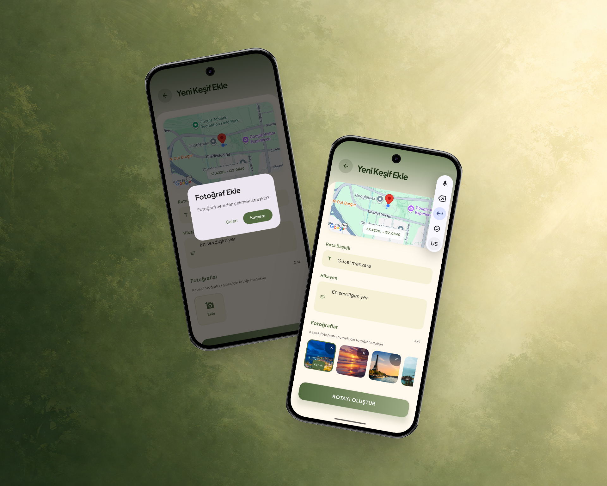
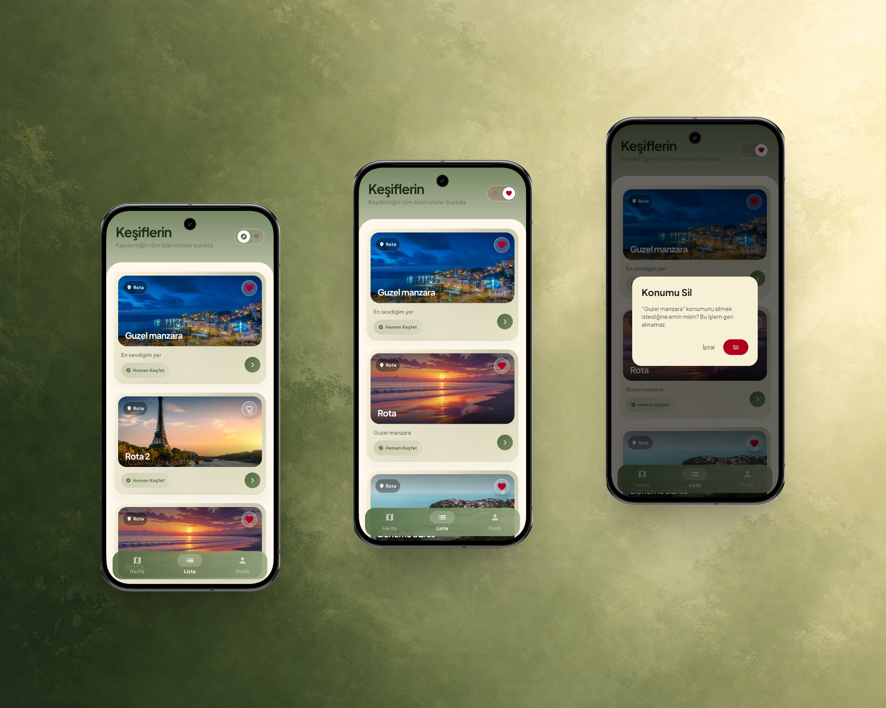
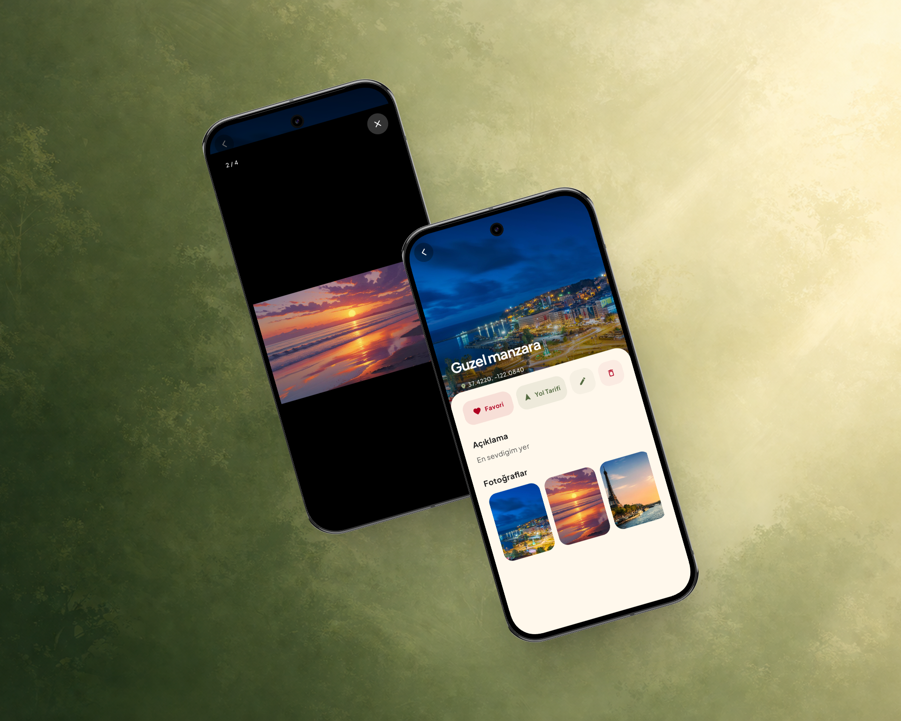
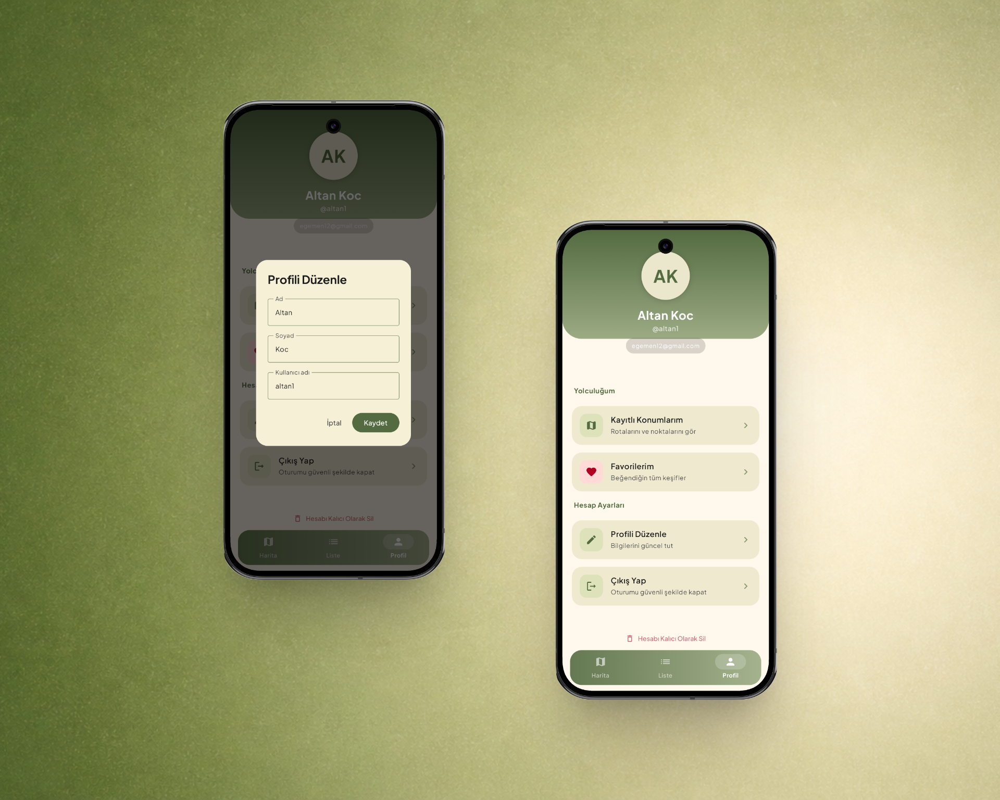

# RotaMe

> A location saving and discovery app — mark your favorite places on the map, upload photos, and revisit your memories anytime.

RotaMe is a native Android application built with **Kotlin** and **Jetpack Compose**. Users can register, save locations on an interactive Google Map, upload up to 4 photos per location, mark favorites, and manage their profile. The app communicates with a production-ready Spring Boot backend deployed on AWS.



---

## Authentication

Users can register with their name, surname, username, and email. After logging in, the app stores JWT access and refresh tokens securely using Jetpack DataStore. Tokens are automatically refreshed in the background — if the session expires, the user is silently redirected to the login screen via the `AuthEventBus` mechanism without any disruption.



---

## Map

The home screen opens directly on an interactive Google Map centered on the user's current location. Users can save a new location by tapping the FAB button or long-pressing anywhere on the map. A confirmation dialog appears before navigating to the add location screen, keeping the flow intentional and clean.



---

## Add Location

Users can save a new location by picking a point on the embedded map, entering a name and description, and uploading up to 4 photos from the camera or gallery. One photo can be selected as the cover image. On edit mode, existing photos are displayed and can be individually removed or reassigned as cover.



---

## Locations

The locations screen displays all saved places as rich cards with cover photos, names, descriptions, and coordinates. Locations can be filtered to show only favorites using an animated toggle. Swiping a card to the left reveals a delete action with a confirmation dialog. The list refreshes automatically whenever the screen is opened.



---

## Location Detail

Tapping a location card opens the detail screen with the cover photo displayed full-width at the top. Users can toggle favorites, get turn-by-turn directions via Google Maps, edit the location, or delete it. All uploaded photos are displayed in a horizontal gallery — tapping any photo opens a full-screen pager viewer with swipe navigation between images.



---

## Profile

The profile screen displays the user's avatar initials, full name, username, and email in a gradient header. Users can navigate to their saved locations or favorites, edit their profile information (name, surname, username) via a dialog, log out securely, or permanently delete their account.



---

## Features

- JWT authentication with automatic silent token refresh
- Interactive Google Maps with real-time user location
- Save locations via FAB button or long-press on map
- Upload up to 4 photos per location from camera or gallery
- Cover photo selection with visual indicator
- Edit existing locations including photo management
- Full-screen image viewer with horizontal swipe pager
- Favorite toggle with animated heart interaction
- Filter locations to show favorites only
- Swipe-to-delete with confirmation dialog
- Google Maps turn-by-turn navigation integration
- Profile editing (name, surname, username)
- Auto logout on token expiration via AuthEventBus
- Soft delete account management

---

## API Endpoints

### Auth
| Method | Endpoint | Description |
|--------|----------|-------------|
| `POST` | `/api/v1/auth/register` | Register a new user |
| `POST` | `/api/v1/auth/login` | Login with email or username |
| `POST` | `/api/v1/auth/refresh` | Refresh access token |
| `POST` | `/api/v1/auth/logout` | Logout and invalidate refresh token |

### Locations
| Method | Endpoint | Description |
|--------|----------|-------------|
| `POST` | `/api/v1/locations` | Create a new location |
| `GET` | `/api/v1/locations` | Get all locations (paginated) |
| `GET` | `/api/v1/locations?onlyFavorites=true` | Get favorite locations |
| `GET` | `/api/v1/locations/{id}` | Get location by ID |
| `PUT` | `/api/v1/locations/{id}` | Update location |
| `DELETE` | `/api/v1/locations/{id}` | Soft delete location |
| `PATCH` | `/api/v1/locations/{id}/favorite` | Toggle favorite |

### Location Images
| Method | Endpoint | Description |
|--------|----------|-------------|
| `POST` | `/api/v1/locations/{id}/images` | Upload image (max 5MB) |
| `GET` | `/api/v1/locations/{id}/images` | Get all images for a location |
| `DELETE` | `/api/v1/locations/{id}/images/{imageId}` | Delete image |
| `PATCH` | `/api/v1/locations/{id}/images/{imageId}/cover` | Set cover image |

### User
| Method | Endpoint | Description |
|--------|----------|-------------|
| `GET` | `/api/v1/users/me` | Get current user profile |
| `PATCH` | `/api/v1/users/me` | Update profile |
| `DELETE` | `/api/v1/users/me` | Soft delete account |

---

## Tech Stack

| Layer | Technology |
|-------|------------|
| Language | Kotlin |
| UI Framework | Jetpack Compose + Material3 |
| Architecture | Clean Architecture (Data / Domain / Presentation) |
| Dependency Injection | Hilt (Dagger) |
| Networking | Retrofit + OkHttp + Gson |
| Local Storage | Jetpack DataStore (Preferences) |
| Navigation | Jetpack Navigation Compose |
| State Management | StateFlow + ViewModel |
| Image Loading | Coil |
| Maps | Google Maps SDK + Maps Compose |
| Location | Google Play Services (FusedLocationProvider) |
| Async Operations | Kotlin Coroutines + Flow |

---

## Architecture

RotaMe is built on **Clean Architecture** principles with a **feature-based modular structure**. Each feature owns its own data, domain, and presentation layers with clearly separated concerns, making the codebase scalable, testable, and easy to maintain.

### Data Layer

Each feature defines its own Retrofit API interface, request/response DTOs, and mapper functions that convert raw API responses into clean domain models. Repository implementations live here, wrapping API calls using a centralized `safeApiCall` wrapper that emits `Resource` states (Success, Error, Loading) — so the upper layers never deal with raw network logic directly.

### Domain Layer

The domain layer is the core of the application and has **zero framework dependencies**. It contains pure Kotlin data classes representing business models, repository interfaces that define contracts for the data layer, and use cases that encapsulate individual business actions. Every use case follows the **Single Responsibility Principle** and is invoked via Kotlin's `operator fun invoke()`, keeping the calling code clean and expressive.

### Presentation Layer

The entire UI is built with **Jetpack Compose** and **Material3**. Each screen has a dedicated `ViewModel` annotated with `@HiltViewModel`, which exposes UI state through `StateFlow`. This ensures a clear **unidirectional data flow** — the UI observes state reactively and dispatches user actions to the ViewModel, which delegates work to the appropriate use case.

### Core Module

The `core` module provides shared infrastructure that every feature depends on:

- **AuthInterceptor** — automatically injects the Bearer token into every outgoing request and handles silent token refresh on 401/403 responses
- **AuthEventBus** — a `SharedFlow`-based event bus that broadcasts unauthorized events app-wide, triggering automatic navigation to the login screen
- **TokenDataStore** — persists access and refresh tokens securely using Jetpack DataStore Preferences
- **SafeApiCall** — a centralized error handling wrapper for all network calls, emitting typed `Resource` states
- **Permission Handlers** — reusable Composables for Camera, Gallery, and Location runtime permissions

### Project Structure

```
com.altankoc.rotame
├── core
│   ├── datastore/          # TokenDataStore
│   ├── network/            # AuthInterceptor, AuthEventBus, SafeApiCall
│   ├── util/               # Resource, PermissionHandlers
│   └── ui/
│       ├── theme/          # Color, Type, Theme
│       ├── components/     # RotaMeBottomBar
│       └── screens/        # SplashScreen
├── di/                     # NetworkModule, RepositoryModule
├── navigation/             # NavGraph, Screen, BottomNavItem
└── feature
    ├── auth/               # Login, Register
    │   ├── data/           # DTOs, ApiService, RepositoryImpl
    │   ├── domain/         # Models, Repository interface, UseCases
    │   └── presentation/   # ViewModels, States, Screens
    ├── location/           # List, Detail, AddEdit
    │   ├── data/
    │   ├── domain/
    │   └── presentation/
    ├── map/                # Map screen
    │   └── presentation/
    └── profile/            # Profile management
        ├── data/
        ├── domain/
        └── presentation/
```

### Design Pattern

RotaMe follows the **MVVM (Model-View-ViewModel)** design pattern integrated within the Clean Architecture structure:

- **Model** — Domain models and repository interfaces define the business data and contracts. Use cases bridge ViewModels and repositories, encapsulating business rules in isolated, reusable units.
- **View** — Jetpack Compose screens are purely declarative. They observe state from the ViewModel and contain no business logic. User interactions are forwarded to the ViewModel as function calls.
- **ViewModel** — Each screen has a dedicated `@HiltViewModel` managing UI state using `StateFlow`. ViewModels receive user actions, delegate work to use cases, and update state accordingly — creating a clear unidirectional data flow: **UI observes state → user interacts → ViewModel processes → state updates → UI recomposes.**

---

## Getting Started

### Prerequisites

- Android Studio Ladybug or later
- JDK 17+
- Android SDK 24+ (min) / 35 (target)
- Google Maps API Key

### Setup

1. Clone the repository
```bash
git clone https://github.com/altankocdev/rotame-android-app.git
```

2. Open the project in Android Studio

3. Create a `local.properties` file in the root directory and add your keys:
```properties
MAPS_API_KEY=your_google_maps_api_key
BASE_URL=https://your_backend_url/
```

4. Sync Gradle dependencies

5. Run the app on an emulator or physical device

---

## Related

- **Backend Repository** → [rotame-backend](https://github.com/altankocdev/rotame-backend)

---

## 📄 License
This project is licensed under the MIT License - see the [LICENSE](https://github.com/altankocdev/rotame-android-app/blob/main/LICENSE) file for details.

## 👨‍💻 Developer
**Altan Koç**
* GitHub: [@altankocdev](https://github.com/altankocdev)

---
⭐ **If you found this project helpful, please give it a star!** ⭐

---
*Built with ❤️ using Kotlin and Jetpack Compose*
